# Quadra companion: user guide

The companion is the desktop app for the Quadra knob. It changes the knob's settings, app
profiles, HOME's lamps and MIDI's synths from the computer. This guide is for someone using the app. For building it, see the
[companion README](../README.md); for the protocol and the firmware side, see
[FIRMWARE.md](../../NanoDepsidf/docs/FIRMWARE.md) §10.

The screenshots here are taken in demo mode, a simulated knob that has the firmware's own
built-in profiles and icons. Settings such as Wi-Fi, the clock and System info are made up.

## Contents

1. [Connecting](#1-connecting)
2. [The window](#2-the-window)
3. [Live and saved](#3-live-and-saved)
4. [Mode](#4-mode)
5. [Lamps](#5-lamps)
6. [Synths](#6-synths)
7. [Haptics](#7-haptics)
8. [App profiles](#8-app-profiles)
9. [Knob and keys](#9-knob-and-keys)
10. [Command wheel](#10-command-wheel)
11. [Macros](#11-macros)
12. [Look](#12-look)
13. [Device](#13-device)
14. [System info](#14-system-info)
15. [When something doesn't work](#15-when-something-doesnt-work)

---

## 1. Connecting

There are two ways to run the companion, with the same screens:

| | Quadra app | Web page |
|---|---|---|
| Runs in | Its own window (macOS) | Chrome or Edge |
| Connecting | Finds the knob itself, and again after a replug; over Wi-Fi once paired | Click **Connect** once and pick the knob; automatic after that |
| Safari, Firefox | – | Not supported (no WebHID): the page says **No USB access here** |

**Over Wi-Fi (the app):** once the knob is on your network (**Device › Wi-Fi**), press
**Pair this app** there while it's on USB. From then on, with no cable in, the app reaches it
over Wi-Fi (found by name, `quadra-xxxx.local`); plug a cable in and it moves back to USB within
a few seconds. Pairing hands the app the knob's key: nothing else on the network can read,
forge or replay what goes between them. The network, the password and the key itself change
over USB only.

Wi-Fi carries what this app does: settings, haptics, the lights, the profiles (the list
takes a few seconds to fill), the lamps and the synths. Only the lamp import needs the cable,
since it carries the lamps' keys. With a cable in, the knob's controls (turning it, F1–F4) type
and scroll over USB on the computer the cable goes to. With no cable (the knob on a charger),
they come to this app over Wi-Fi and it types and scrolls on this Mac, once you allow Quadra
under **System Settings › Privacy & Security › Accessibility** (**Device › Wi-Fi › Allow**
asks for it). Keys, the wheel, drags and media keys all work; on a weak signal a drag can
stutter now and then, and if the link drops, nothing stays held down. The music cover, agent
requests and the clock's time come from the Mac service, which reaches the knob over Wi-Fi
too.

The app is signed for this Mac only (ad hoc), so macOS forgets that permission when the app is
rebuilt: remove Quadra from the Accessibility list and allow it again.

Neither needs a driver, and macOS doesn't ask for Input Monitoring permission.

The knob has to start in **HID** mode, which is the normal one. In serial mode (used for
flashing) the companion can't see it.

Until a knob answers, the page says what to do, and the knob's picture in the sidebar is dimmed.

## 2. The window

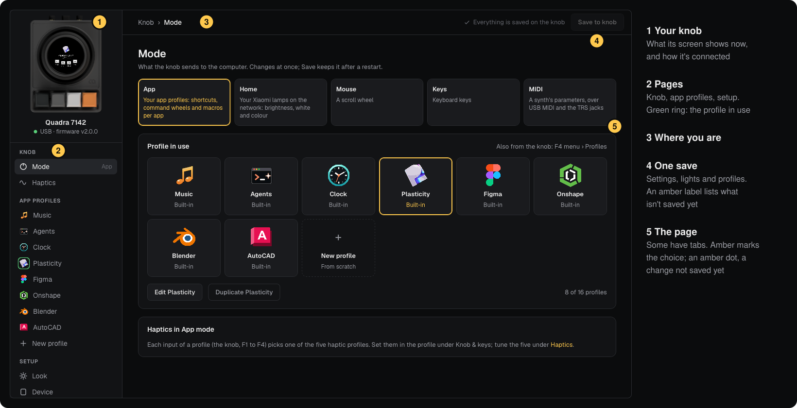

1. **Your knob:** its picture, with what its main screen shows now (the profile in use, or the
   mode), its name and how it's connected (USB or Wi-Fi, and the firmware version).
2. **The pages,** in three groups:
   - **Knob:** **Mode** (what the knob sends), **Haptics** (how it feels), **Lamps** (HOME's
     lamps) and **Synths** (MIDI's synth profiles).
   - **App profiles:** one entry per profile on the knob, and **New profile**. A green ring round
     an icon marks the profile in use.
   - **Setup:** **Look**, **Device** and **System info**.
3. **Where you are.**
4. **One save** for everything: settings, the lights, app profiles and synths. See
   [Live and saved](#3-live-and-saved).
5. **The page.** Some pages have tabs. Amber marks the choice that's on; a small amber dot marks
   a change that's live on the knob but not saved yet (on a card, and on its page in the sidebar).

The app doesn't mirror the knob's screen or its lights live: the knob itself shows that.

## 3. Live and saved

Every change goes to the knob at once, so you feel it while you adjust it. It is stored only
when you save:

- **Save to knob** (top right) stores everything that isn't stored yet. Pressing **F2** in the
  knob's own menu stores the settings and the lights.
- The amber label beside it says how many things aren't saved, and where. Click it for the
  list, with a **Revert** for each:

  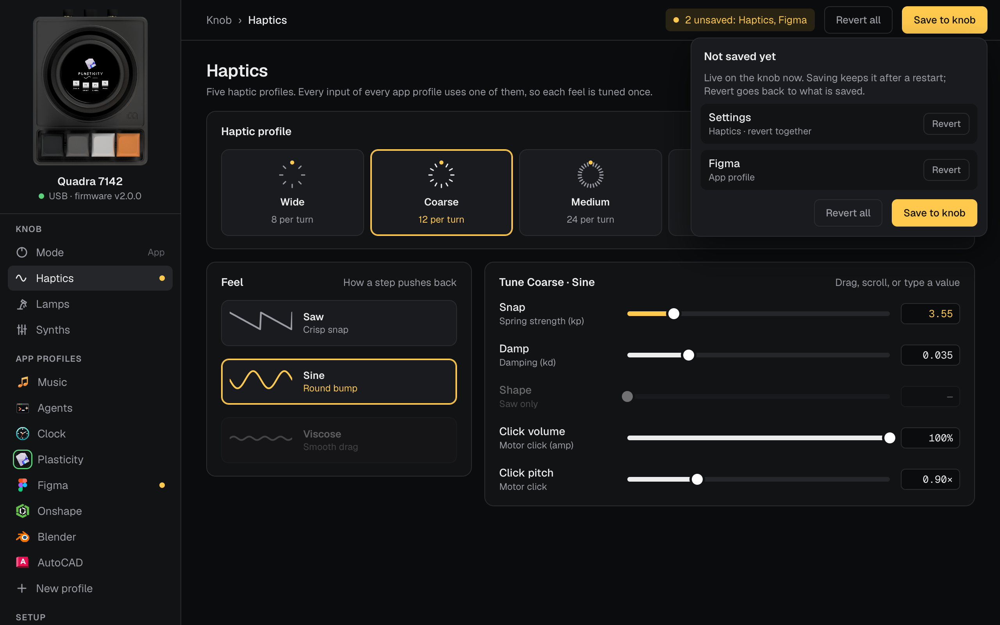

  Settings and the lights revert together (the knob keeps them as one). Each app profile and
  each synth reverts on its own.
- **Revert all** returns everything to what's stored.
- A change that isn't saved is lost when the knob loses power.

A few things are stored on the knob as soon as you set them, with no Save: the idle word, the
music cover style, the clock, Wi-Fi, and the lamps' names, icons and order. Their pages say so.

## 4. Mode

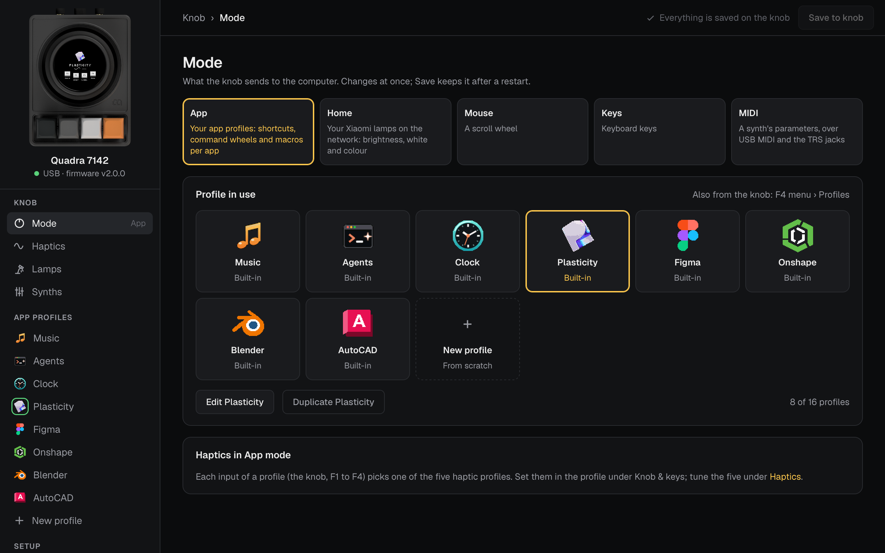

**Mode** is what the knob sends to the computer:

| Mode | What the knob does |
|---|---|
| **App** | Follows an app profile |
| **Home** | A remote for your Xiaomi lamps on the network |
| **Mouse** | Scroll wheel |
| **Keys** | Keyboard keys |
| **MIDI** | A controller for a synth, over USB MIDI and the knob's TRS jacks |

In **App** mode, **Profile in use** lists the profiles on the knob with the icons the knob
draws (their black is see-through, as on the knob); click one to use it (on the knob: F4 menu › Profiles). Under each name is where it comes
from:

| Label | Meaning |
|---|---|
| **Built-in** | Part of the firmware, unchanged |
| **Built-in, changed** | A built-in with a stored copy of your edits |
| **Yours** | A profile you made, stored on the knob |
| **Not saved** | Has edits that are live but not stored |

**Edit** opens the profile in use, **Duplicate** makes a copy of it, and **New profile** makes an
empty one; both new ones open straight away, in use. The knob holds up to 16 profiles.

In **Mouse** and **Keys**, the page shows which haptic profile the knob uses in that mode; each
mode keeps its own:

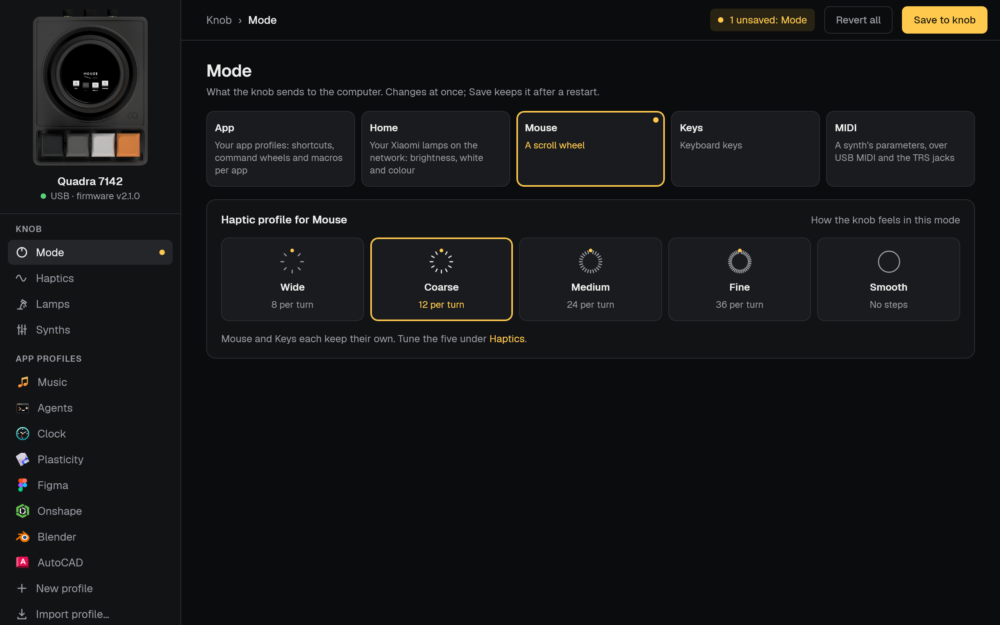

In **Home**, the knob finds your lamps on the network and changes them itself; the page lists
them with what each is doing now, and links to [Lamps](#5-lamps) and the import.

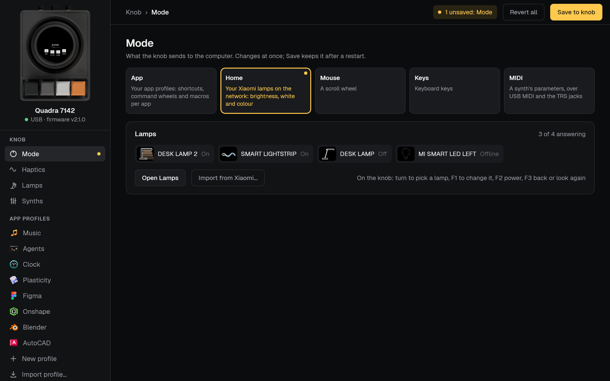

In **MIDI**, pick the **Synth** whose parameters the knob turns (GENERIC for General MIDI
controllers and a DAW's MIDI learn, the KORG minilogue xd, the Roland JU-06A or TR-8S, or one of
your own; **Edit synths…** opens [Synths](#6-synths); on the knob:
F4 menu › Profiles › MIDI › F1 to SYNTH) and the **MIDI channel** to send on; the note says which
channel the synth comes set to. On the knob, turn to change the parameter on its screen, F1 for
the next one (hold F1 and turn to pick from the list), F2 and F3 for the synth's program. See the
README's MIDI section.

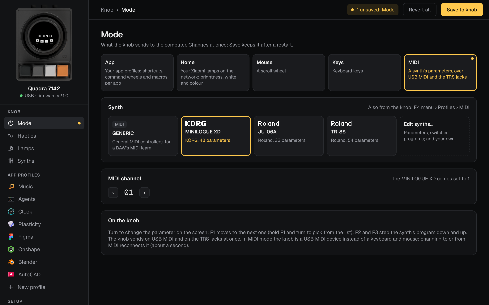

In MIDI mode the knob is a USB MIDI device instead of a keyboard and mouse, so changing to or
from MIDI makes it reconnect: the app shows it looking for the knob for a second or so, then
carries on. Over WiFi nothing changes.

## 5. Lamps

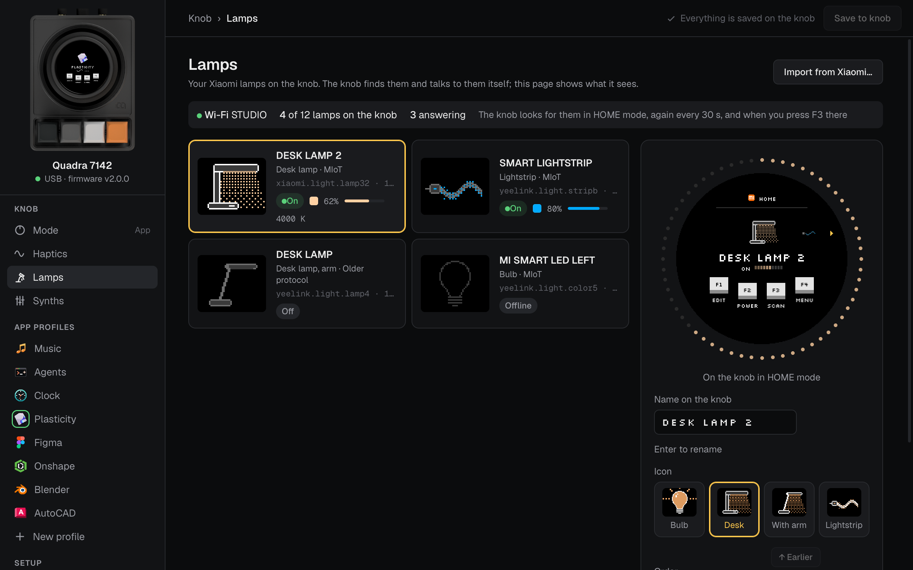

**Lamps** shows HOME's lamps as the knob sees them, asked every second: each one drawn the way
the knob draws it, lit in its colour, with **On**, **Off**, **Offline** (it doesn't answer) or
**No reply** (a change got no answer), its brightness and white or colour, its model, and the
address and protocol it answers on. The knob talks to the lamps itself; the app never does.

Pick a lamp to see the knob's HOME screen with it and to change:

| Setting | What it does |
|---|---|
| **Name on the knob** | Up to 19 characters, in the knob's capitals. Press Enter to rename |
| **Icon** | Bulb, desk lamp, desk lamp with an arm, or lightstrip |
| **Order** | Where it sits in the knob's list |
| **Remove from knob** | Takes it off the knob (asks once more). Import it again to get it back |

These are stored on the knob at once, over USB or Wi-Fi (firmware with extensions v12).

### Importing lamps

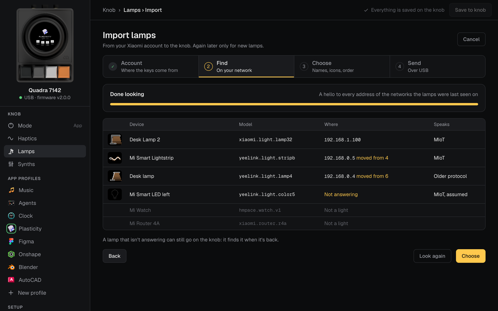

**Import from Xiaomi…** puts the lamps of your Xiaomi account on the knob, in four steps:

1. **Account:** the list of your devices and their keys, saved by the token extractor in
   `~/.quadra/xiaomi-devices.json`. **Sign in to Xiaomi…** opens the extractor in Terminal for
   a new list (sign in with the QR code in Mi Home, or your password, and choose your server);
   **Look again** reads it once it's done. The extractor has to be installed in
   `~/.quadra/token-extractor` (see the README's HOME section).
2. **Find:** the app looks up what each light can do in its public spec, says hello to every
   address of the networks the lamps were last seen on, and asks each lamp which protocol it
   answers. A lamp that moved shows its new address; one that doesn't answer can still go on
   the knob, which finds it when it's back.
3. **Choose:** which lamps, their names (from Mi Home, without the brand word), icons (guessed
   from the model) and order. The knob holds 12.
4. **Send:** over USB only, since it carries the lamps' keys. It replaces the lamps on the knob.

The keys stay in that file on this Mac and on the knob; the app never shows them. The import
needs the Quadra app (a web page can't read the file or look on the network); in a terminal,
`quadra.py home import` does the same.

## 6. Synths

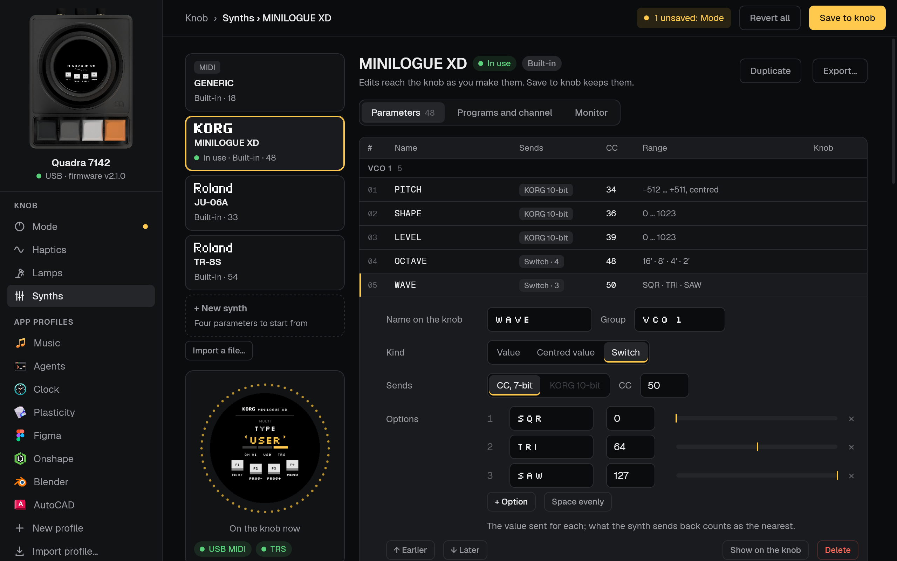

**Synths** edits MIDI mode's synth profiles the way [App profiles](#8-app-profiles) are edited:
changes reach the knob a moment after you make them, **Save to knob** keeps them, and
**Revert** goes back. Firmware with extensions v12 is needed.

On the left are the knob's synths, each with its maker's mark and where it comes from
(**Built-in**, **Built-in, changed**, **Yours**), and below them the knob's screen for the
parameter you're on: live when it's the synth in use. **New synth** starts one with four
parameters, **Import a file…** adds one from a JSON file, and **Duplicate** and **Export…** (to
Downloads) are at the top of each synth. The knob holds 16 synths.

**Parameters** lists them in the order F1 steps through, by group. The one the knob is on now
has a green dot and its value. Click one to change it:

| Setting | What it sets |
|---|---|
| **Name on the knob**, **Group** | Up to 11 characters each; the group is the caption above the name |
| **Kind** | **Value** (0 to 127, or 1023), **Centred value** (shown as − / + around the middle, like pan or tune), or **Switch** |
| **Sends** | **CC, 7-bit**, or **KORG 10-bit** (CC 63 carries the low bits first: the minilogue xd's full resolution), and the CC number |
| **Options** | A switch's 2 to 8 options: each one's name and the value it sends. **Space evenly** spreads them over 0 to 127 |

**↑ Earlier** and **↓ Later** move a parameter, **Delete** removes it, **+ Parameter** adds
one after it (up to 64), and **Show on the knob** moves the knob to it. The feel follows the
kind: fine steps for a value, a click per option for a switch, walls at the ends.

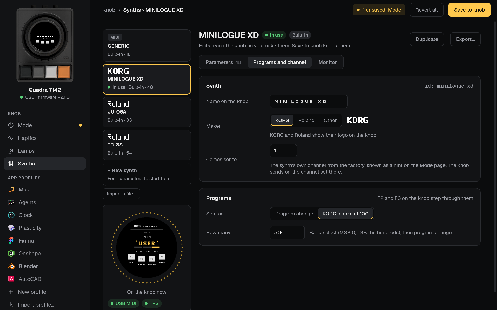

**Programs and channel:** the synth's name on the knob, its maker (KORG and Roland show their
logo on the knob), the channel it comes set to (a hint on the Mode page; the knob sends on the
channel set there), and how F2 and F3 step its programs: **Program change** (up to 128), or
**KORG, banks of 100**. At the bottom, **Reset to default** brings a changed built-in back, or
**Delete synth** removes one of your own.

**Monitor** lists what the knob sends on USB MIDI (the same goes out on the TRS jacks), each
message with the parameter it moved. It reads the knob's MIDI port, which exists in MIDI mode
only, and needs the Quadra app. What the synth sends back goes to the knob, which counts it.

## 7. Haptics

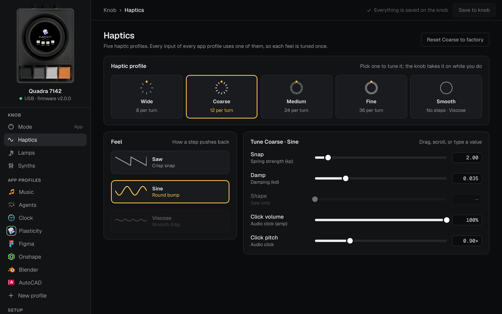

A **haptic profile** is a complete feel: how far apart the steps are, how a step pushes back,
and how strongly. There are five, and everything uses them: the modes, and each input of each
app profile. Tune one here and it changes everywhere it's used.

| Haptic profile | Steps per turn |
|---|---|
| **Wide** | 8 |
| **Coarse** | 12 |
| **Medium** | 24 |
| **Fine** | 36 |
| **Smooth** | None: a smooth drag |

Pick one to tune it; the knob takes it on while you do.

**Feel** is how a step pushes back. Each feel keeps its own tuning, so switching feel shows that
feel's values. Wide, Coarse, Medium and Fine offer Saw and Sine; Smooth is always Viscose.

| Feel | What it's like |
|---|---|
| **Saw** | A crisp snap into each step |
| **Sine** | A round bump |
| **Viscose** | A smooth drag, with no steps (Smooth only) |

**Tune** has five sliders for that haptic profile and feel. Drag one, scroll over it, use the
arrow keys, or type a value in its box. The knob only accepts values inside a safe range for
that profile and feel, so the sliders' ranges change with them.

| Slider | What it sets |
|---|---|
| **Snap** | How firmly a step holds (kp). Not used in Viscose |
| **Damp** | How much the knob resists fast turning (kd) |
| **Shape** | How late the pull of a step rises. At 0% it grows evenly from the centre; higher values make the centre softer and the rise near the next step steeper. Saw only |
| **Click volume** | The click the motor plays. In Viscose it is off by default and goes up to 20% |
| **Click pitch** | The click's pitch. In Viscose, 1× to 2× |

**Click**, under the sliders, is the sound the motor makes on each step: nine to pick from,
sine or square, 2 or 4 ms, with a steady or a falling pitch, and Tick, Ting and Tap, each
drawn as it sounds. Every
haptic profile has its own, and the knob plays it as you pick. (On the knob: F4 menu ›
Haptics › Click.) The box is missing with firmware before 2.1.0, which played its clicks
through a speaker.

A slider that doesn't apply in the current feel is greyed out and shows `—`.

**Reset … to factory** puts the chosen haptic profile back to its original feel and values. Like
any change it is live at once and stored when you save. On the knob, holding F2 for 1.5 seconds
on the Haptics screen does the same.

## 8. App profiles

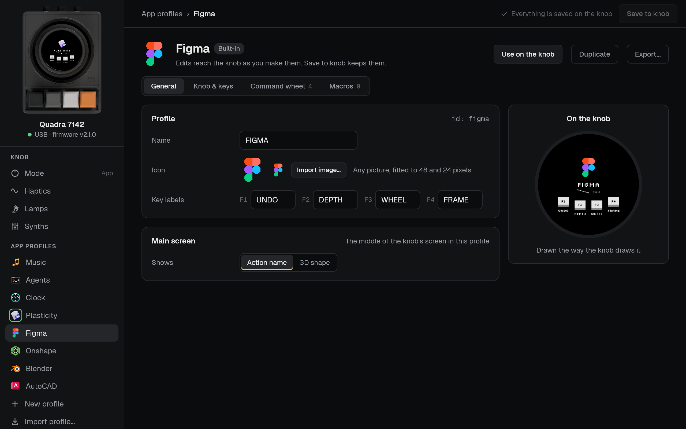

Click a profile in the sidebar to open it. Every profile can be edited, the built-in ones too.
The header shows its state: **In use** (or a **Use on the knob** button), where it comes from,
and **Live, not saved** while it has unsaved edits. An edit goes to the knob a moment after you
make it, so you can try it straight away; the line under the name says when it's sent, or what
the knob refused and why.

A profile has four tabs.

**General:**

| Field | What it is |
|---|---|
| **Name** | Up to 15 characters |
| **Icon** | **Import image…** takes any picture and makes the 48 px and 24 px icons the knob draws |
| **Key labels** | The words under F1–F4 on the knob's screen, up to 7 characters each |
| **Main screen** | The middle of the knob's screen: the **Action name**, or a **3D shape** (cube, pyramid or octa, in three styles) that moves as you turn |

**On the knob** shows the main screen drawn the way the knob draws it. At the bottom,
**Reset to default** (a changed built-in) deletes your stored copy, so the original shows again;
**Delete profile** (one of your own) removes it from the knob. Both ask once more before they act.

The other tabs: [Knob & keys](#9-knob-and-keys), [Command wheel](#10-command-wheel) and
[Macros](#11-macros).

## 9. Knob and keys

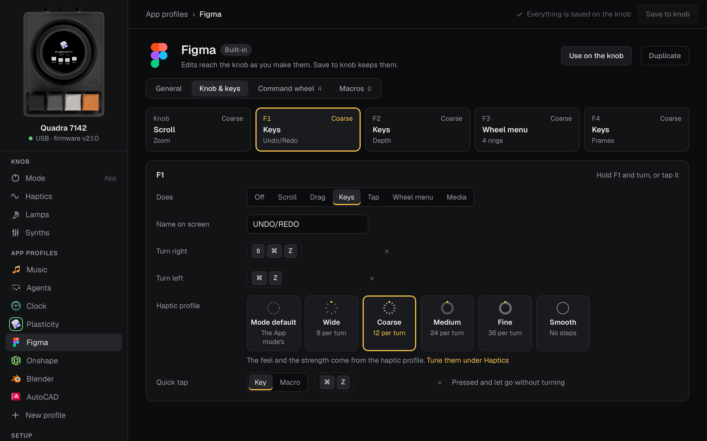

There are five inputs: the **Knob** turned by itself, and the knob turned while holding **F1**,
**F2**, **F3** or **F4**. The row at the top shows what each one does and its haptic profile;
click one to set it up below. Each is set to one of these:

| Does | What it sends | Its settings |
|---|---|---|
| **Off** | Nothing | – |
| **Scroll** | The scroll wheel | Modifier keys held, direction |
| **Drag** | A mouse drag | Mouse button, modifier keys, axis, speed, direction |
| **Keys** | One shortcut per step | One for turning right, one for turning left |
| **Tap** | A shortcut or a macro on a press (F1–F3) | The shortcut, or the macro |
| **Wheel menu** | Opens the command wheel (F1–F3) | Its rings are on the Command wheel tab |
| **Media** | Media keys: play / pause, next, previous, volume, mute (knob, F1–F3) | The knob: one for each way and the volume step (Fine = a quarter step on a Mac); a key: the one it sends on press |

- **Name on screen** is what the knob's screen shows while that input is in use.
- **Haptic profile** is how that input feels: **Mode default** (the App mode's own), or one of
  the five haptic profiles. That's the only haptic choice per input: the feel and the strength
  come from the haptic profile, tuned once under [Haptics](#7-haptics). A wheel menu needs
  steps, so it can't use Smooth.
- **Quick tap** (F1–F3) is a shortcut or a macro sent when you press and let go without turning.
  It works alongside the turning action of the same key.
- **F4** has no press actions: held still, it opens the knob's menu.

To set a shortcut, click its field and press the keys. Hover over it for the ⌃ ⌥ ⇧ ⌘ buttons,
for shortcuts the system keeps to itself (⌘Q, ⌘Tab); × clears it.

## 10. Command wheel

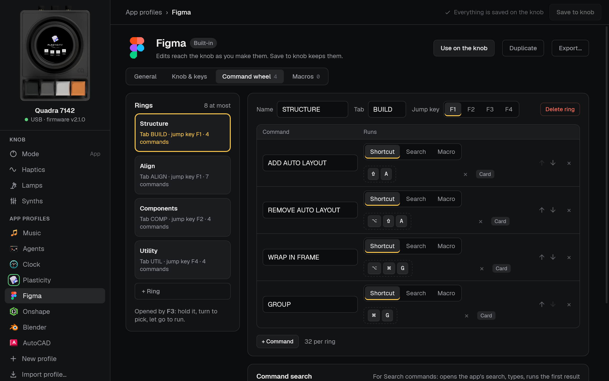

The command wheel appears on the knob while you hold a key set to **Wheel menu**: turn to pick
a command, let go to run it. The tab says which key opens it.

- A **ring** is a group of commands, with a **Name**, a short **Tab** label, and a **Jump key**
  (F1–F4) that jumps to it while the wheel is open. Up to 8 rings; pick one on the left to edit it.
- A **command** has a name and runs one of:
  - **Shortcut:** a key combination.
  - **Search:** text typed into the app's own command search. **Command search** below sets the
    shortcut that opens the search and how long to wait for it and for its results.
  - **Macro:** one of the profile's macros.
- ↑ and ↓ reorder commands, × deletes one. Up to 32 commands in a ring.
- A **Card** tag means the command has an animated illustration on the knob; **Value** means it
  sets a number afterwards. Both are kept as they are, and can't be edited here yet.

## 11. Macros

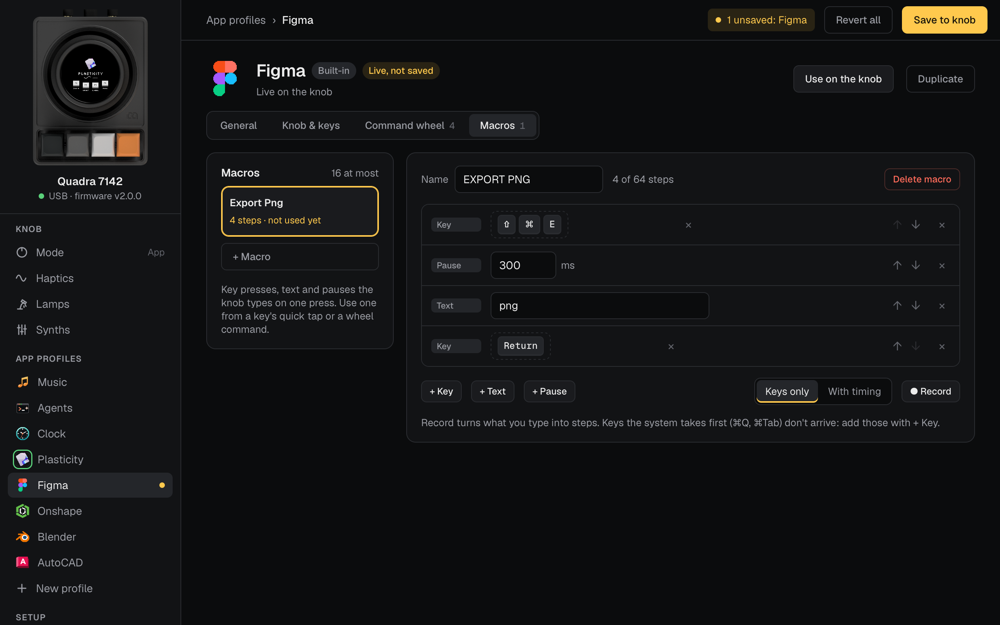

A macro is a list of steps the knob types by itself. It is stored on the knob, so it works
with no app running.

| Step | What it does |
|---|---|
| **Key** | Presses one shortcut |
| **Text** | Types text (plain ASCII, up to 120 characters, as US keys) |
| **Pause** | Waits, up to 10 seconds |

Build a macro with **+ Key**, **+ Text** and **+ Pause**, or record one:

1. Choose **Keys only**, or **With timing** to keep the pauses between your key presses.
2. Click **Record** and type.
3. Click **Stop**.

Shortcuts the system takes first (⌘Q, ⌘Tab) can't be recorded. Add those with **+ Key**.

To use a macro, set a key to **Tap** and choose **Macro**, set a key's **Quick tap** to
**Macro**, or set a command to **Macro**. The list says how often each macro is used. Renaming a
macro updates the places that use it; deleting it clears them.

A profile holds up to 16 macros of up to 64 steps each. The knob types about 50 keys a second.

## 12. Look

Three tabs: **Lights**, **Screen & music** and **Clock**. Lights and the clock need firmware with
the extensions (2.0 and later).

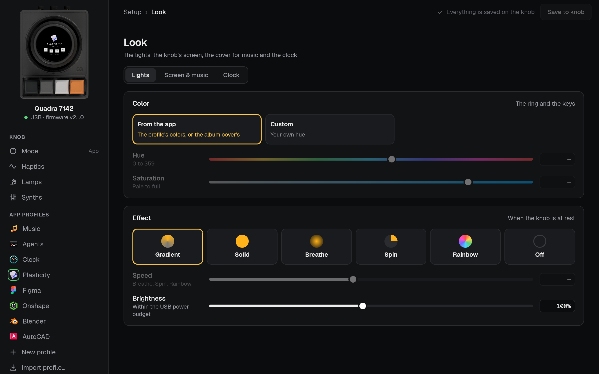

**Lights:**

| Setting | What it sets |
|---|---|
| **Color** | The ring and the keys: **From the app** (the profile's colours, or the album cover's while music plays) or **Custom**, with your own **Hue** and **Saturation** |
| **Effect** | At rest: Gradient, Solid, Breathe, Spin, Rainbow or Off; **Speed** for the moving ones; **Brightness** within the USB power budget |

The lights are live on the knob while you change them and kept by **Save to knob** (or F2 on
the knob's own Lights screen). Changes made on the knob show up here within a second.

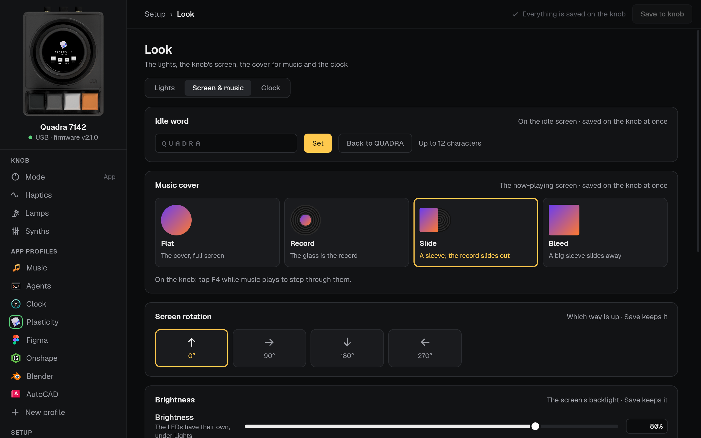

**Screen & music:**

| Setting | What it sets |
|---|---|
| **Idle word** | The word on the idle screen, up to 12 characters (lowercase draws as small capitals). **Back to QUADRA** restores it. Stored on the knob as soon as you press **Set** |
| **Music cover** | How the Music app shows the cover while something plays: **Flat** (full screen), **Record** (the glass is a spinning record, the cover its label), **Slide** (a sleeve the record slides out of) or **Bleed** (a big sleeve that slides off the glass). Stored on the knob at once. On the knob, a tap of F4 on the now-playing screen steps through them (extensions v8 and later) |
| **Screen rotation** | 0, 90, 180 or 270 degrees. Kept by Save to knob |

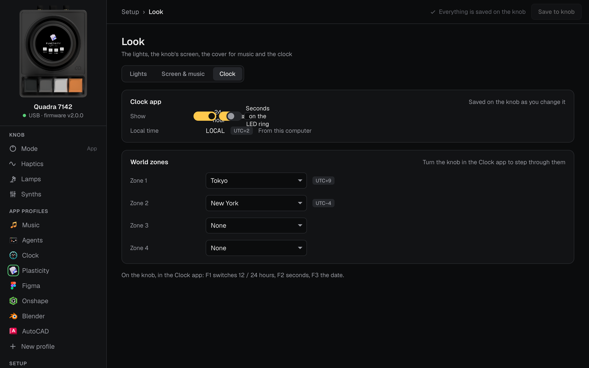

**Clock** (the Clock app, extensions v5 and later): what it shows — **24-hour**, **Seconds**,
**Date**, and **Seconds on the LED ring** — and up to four world zones besides the local time,
which is this computer's (the Mac service sends the time and the zone; with Wi-Fi on, the knob
also sets its clock from the internet). Each zone follows its own daylight-saving rules. In the
Clock app on the knob, turning steps through the zones; F1 switches 12 / 24 hours, F2 the
seconds, F3 the date. Stored on the knob as you change them.

## 13. Device

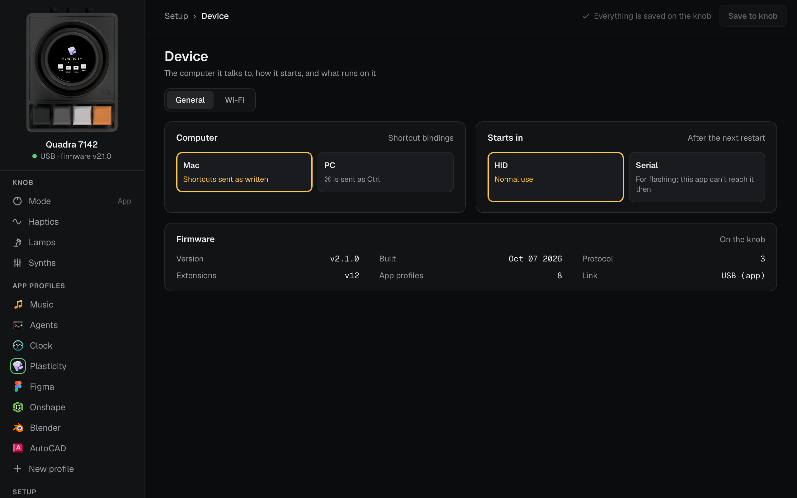

**General:**

| Setting | What it sets |
|---|---|
| **Computer** | The computer on the other end. On **PC**, shortcuts written with ⌘ are sent with Ctrl |
| **Starts in** | **HID** for normal use, **Serial** for flashing. Applies after a restart |
| **Firmware** | Version, build date, protocol version, extensions, number of app profiles, and the link in use (USB, Wi-Fi or WebHID) |

**Take care with Starts in:** once the knob restarts in serial mode, the companion can't reach
it. Switch back in the knob's own menu: **BOOT MODE › USB MODE › HID**, then restart.

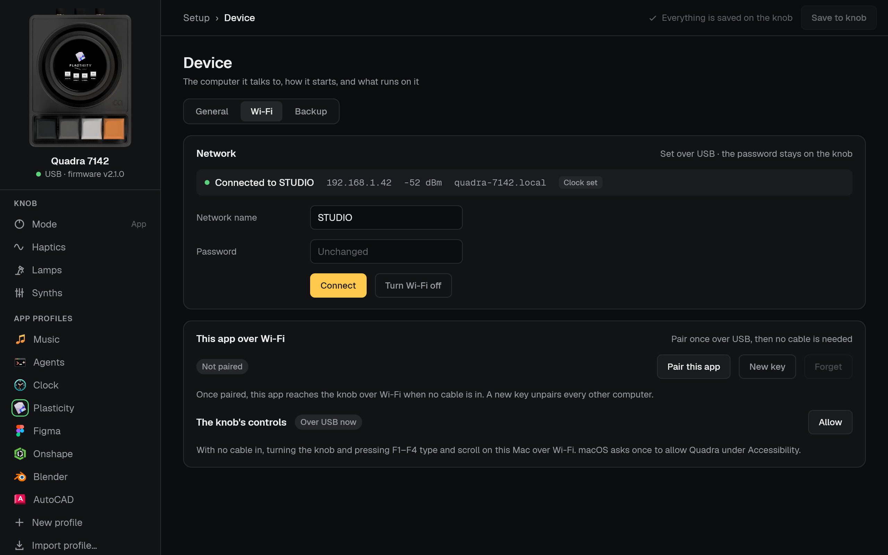

**Wi-Fi** (firmware with Wi-Fi, extensions v4 and later): the network the knob joins (set over
USB; the password stays on the knob) and its address, then **This app over Wi-Fi** (the app
only, not the web page): **Pair this app** (see [Connecting](#1-connecting)), **New key** (asks
once more: every other paired computer has to pair again) and **Forget**. With firmware that
has it, **The knob's controls** shows whether they come to this Mac over Wi-Fi (**On**), or
whether macOS still needs to allow it (**Allow**).

## 14. System info

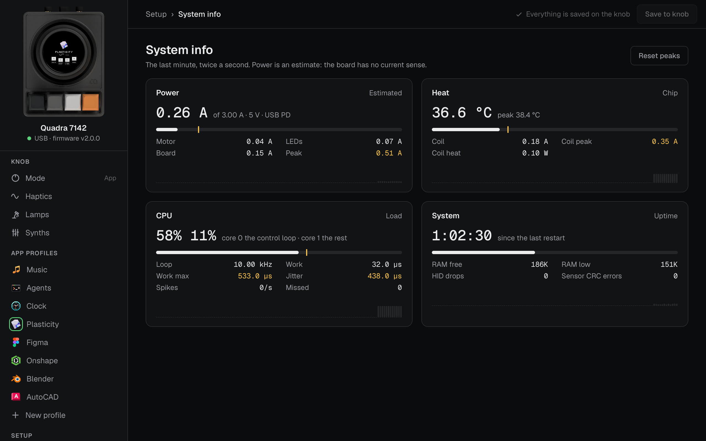

Four tiles, each with a gauge, its numbers, and a chart of the last minute. A tick on a gauge
marks the peak, and **Reset peaks** clears the peaks. Amber numbers are peaks, or counters that
should be zero and aren't.

| Tile | What it shows |
|---|---|
| **Power** | Current drawn, against what the USB port offers; split into motor, LEDs and board. It's an estimate: the board can't measure current |
| **Heat** | Chip temperature, and the motor coil's current and heating |
| **CPU** | Load on each core. Core 0 runs only the control loop: its rate, work time, jitter, spikes and missed ticks |
| **System** | Uptime, free memory, and counters for dropped HID reports and sensor errors |

The knob sends these numbers only while this page is open: it does a little work for each
report, so the app doesn't ask for them otherwise.

## 15. When something doesn't work

| What you see | What to do |
|---|---|
| **Looking for your Quadra** stays | Check the cable. Check the knob starts in HID mode (knob menu: BOOT MODE) |
| **No USB access here** (web page) | Open the page in Chrome or Edge, or use the app |
| **Connect your Quadra** (web page) | Click **Connect** and pick the knob; the browser asks once |
| A setting came back after a restart | It wasn't saved. Change it again and press **Save to knob** |
| An edit is refused, with a message under the profile's name | The message says which field: for example a name that's too long, or text that isn't plain ASCII |
| **New profile** and **Duplicate** are greyed out | The knob already holds 16 profiles. Delete one |
| **Sign in to Xiaomi…** says the extractor isn't installed | Install it in `~/.quadra/token-extractor` with its `.venv` (README, HOME) |
| The import finds a lamp but says **Not answering** | It's off at the switch, or on another network. Import it anyway: the knob finds it when it's back |
| **Send** is greyed out in the import | The knob is on Wi-Fi: the lamps' keys only go over USB. Plug it in |
| The Monitor says **No MIDI port** | The knob has one in MIDI mode only: pick MIDI on the Mode page |
| A synth edit is refused | The message under its name says which parameter and why (a name too long, a CC over 127, a switch with one option) |

---

The Look page, Wi-Fi and pairing, and the Media input were contributed by
[@Dviros](https://github.com/Dviros) in
[pull request #17](https://github.com/katbinaris/NanoD_RatchetH1/pull/17).
